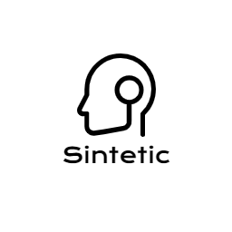

<h1 align="center">
<br>
  
<br>
<br>
Sintetic
</h1>

<p align="center">A python application for making automatic videos integrated with youtube, simply and quickly.</p>

<p align="center">
  <a href="http://makeapullrequest.com">
    
  </a>
  <a href="https://opensource.org/licenses/MIT">
    
  </a>
  <a href="http://www.cefet-rj.br/">
    
  </a>
</p>

<hr />

## Features

This project features all the latest tools and practices in development!

- 🐍 **Python** — Is a programming language that lets you work more quickly.
- 🤖 **IBM Watson** — IBM Service for AI tooling and integrate with applications.
- 🌐 **Wikipedia** — The best online encyclopedia.
- 💖 **Google Images** - API for fetch and download images.
- 💎 **OpenCV** - Is a library of programming functions mainly aimed at real-time computer vision.
- 🎧 **OAuth2 - Youtube** — Auth with your Google Account in Youtube.

## Getting started

_Before you run this application you have [python](https://www.python.org/downloads/), version 3, and pip installed locally_.

1. Clone this repo using `https://github.com/ocoiel/sintetic.git`
2. Move to the appropriate directory: `cd sintetic`.<br />
3. Run `pip install -r requirements.txt` to install dependencies.<br />
4. Download _punkt_ of `NLTK`, the python module for _Natural Language Toolkit_:

_Open a python terminal with `python3` and_:
```
import nltk
nltk.download("punkt")
```

_Add API keys_:

1. For Google Cloud API: rename `client_secrets_example.json` in src for `client_secrets.json` and fill in the fields

```
{
  "web": {
      "client_id":"",
      "project_id":"",
      "auth_uri": "https://accounts.google.com/o/oauth2/auth",
      "token_uri": "https://accounts.google.com/o/oauth2/token",
      "auth_provider_x509_cert_url":"",
      "client_secret":"",
      "redirect_uris":["", ""],
      "javascript_origins":["", ""]
  }
}
```

2. For IBM Watson API: in `src/text.py` fill in the fields this way:

```
self.natural_language_understanding = NaturalLanguageUnderstandingV1(
    version="fill-here",
    iam_apikey="fill-here",
    url="fill-here")
```

_And finally... Run the master file `src/master.py` and see the magic!_ :rocket:

## Contributing

Please read [CONTRIBUTING.md](CONTRIBUTING.md) for details on our code of conduct, and the process for submitting pull requests.

## License

This project is licensed under the MIT License - see the [LICENSE.md](LICENSE.md) file for details.
